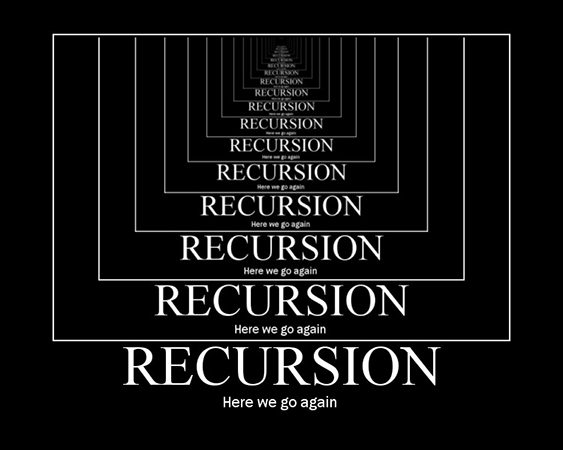
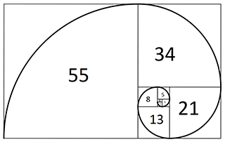
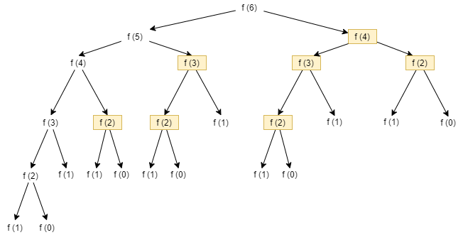
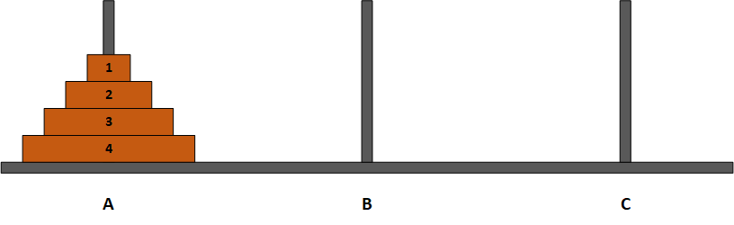
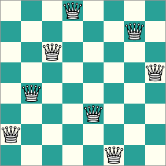
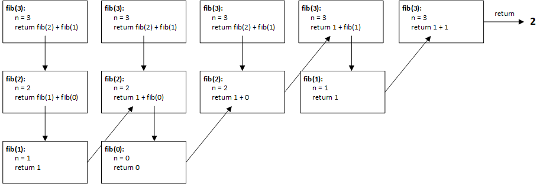

```{r setup, include=FALSE}
library(tufte)
# invalidate cache when the tufte version changes
knitr::opts_chunk$set(cache.extra = packageVersion('tufte'))
options(htmltools.dir.version = FALSE)
```

# Introduction

Recursion is a commonly used, yet often difficult to grasp problem solving technique. Recursion itself is not an algorithm, but a process that can be implemented as part of an algorithm. The notion of recursion sometimes conjures up mental images like the one shown below, which is reminiscent of what one might see when two mirrors are placed so they are facing each other, allowing an image to be reflected back and forth indefinitely:

{width="563" height="450"}  

We may think about solving a problem recursively during the process of problem decomposition, where we are trying to break a complex problem into smaller, less complex sub-problems that are easier to solve. For certain types of problems we may find that we can repetitively decompose a problem such that each sub-problem is really just a smaller version of the larger problem. In those cases, recursion may be an excellent way to solve those problems. The notion of a larger problem being repetitively broken down into similar but smaller problems is encapsulated in the diagram above.

In order for recursion to work, however, there must be a **base case**, which can be computed without using recursion. The base case serves as a termination point for recursion. Without a base case, infinite recursion results, which is similar to an infinite loop. A base case is conspicuously absent in the above diagram.

# Some Classical Examples of Recursive Problems

Examples of problems that lend themselves to recursive solutions abound. We'll look briefly at a few of the more classical examples of recursive problems here, but this list is by no means exhaustive.

## Calculating Fibonacci Numbers

The Fibonacci sequence is a famous mathematical sequence:

0, 1, 1, 2, 3, 5, 8, 13, 21, 34, 55, 89, ...

If squares whose sides measure individual Fibonacci numbers (except 0) are created and arranged as shown in the following diagram, a spiral that is found throughout nature can be drawn:

{width="320" height="202"}      

Furthermore, for any consecutive pair of Fibonacci numbers, if you divide the greater number by the lesser number; e.g., $\frac{13}{8}$, you will get a decimal value that is very close to the Golden Ratio, an irrational number approximately equal to $1.61803...$

The rule for computing the $n$th Fibonacci number is very simple:
$$
F(n)=\begin{cases}
 0,&\text{for } n=0.\\
 1,&\text{for } n=1.\\
 F(n-1)+ F(n-2),&\text{otherwise.}
\end{cases}
$$
In plain English, any given Fibonacci number is equal to the sum of the previous two Fibonacci numbers in the sequence. The exceptions, of course, are the first two Fibonacci numbers, which are given as 0 and 1, respectively. Once you have the first two numbers in the sequence you can use the above rule to compute any other Fibonacci number.

To see how recursion might be used to find the $n$th Fibonacci number, you would begin at $n$, then you need to compute $F(n-1)$ and $F(n-2)$. To compute $F(n-1)$ you would compute $F(n-2)$ and $F(n-3)$ , and to compute $F(n-2)$ you would compute $F(n-3)$ and $F(n-4)$, and so on, until $n = 1$ and $n=0$, whose Fibonacci number are given by definition. So the first and second Fibonacci number serves as a base case. You can see the computation of $F(6)$ in the following picture. 

{width="500"     }    


It is important to note that the Fibonacci sequence is a 0-based sequence. That is, the first number of the sequence, $F(0)$, is 0, the second number of the sequence, $F(1)$, is 1, the third number of the sequence, $F(2)$, is 1, and so on.

## Euclid's Algorithm

To find the GCD of two integers A and B:

1. If A = 0 then GCD(A,B)=B, since the GCD(0,B)=B, and we can stop.
2. If B = 0 then GCD(A,B)=A, since the GCD(A,0)=A, and we can stop.
3. Write A in quotient remainder form (A = B·Q + R)
4. Find GCD(B,R) using the Euclidean Algorithm since GCD(A,B) = GCD(B,R)

```{python}
def gcd(a, b):
    if a == 0:
        return b
 
    return gcd(b % a, a)
```
Euclid's Algorithm is a classical algorithm for finding the greatest common divisor (GCD) of two integers. The algorithm can be formally stated as follows:

For example, suppose you want to find the GCD of 72 and 54. The following illustrates how the algorithms works:

A = 72, B = 58

Find GCD(A, B), or GCD(72, 58):

A = B * Q + R: 72 = 58 * 1 + 14

Next we must find GCD(B, R). We use the same procedure as in the previous step. When we write the quotient form, we are essentially setting A = B and B = R. Each time we do this we will get a new value for B and a new value for R.

Find GCD(B, R), or GCD(54, 14):

54 = 14 * 3 + 12

Find GCD(B, R), or GCD(14, 12):

14 = 12 * 1 + 2

Find GCD(B, R), or GCD(12, 2):

12 = 2 * 6 + 0

Find GCD(B, R), or GCD(2, 0):

Since B = 0, we can stop, and say that GCD(2, 0), and therefore GCD(72, 58) = 2.

Euclid's Algorithm lends itself to a recursive solution since at each step we are solving a smaller version of the same problem. We are still solving GCD(A, B), we just keep reducing the values of A and B until one of them reaches 0, at which point we have a base case and can conclude that the GCD is whichever number, A or B, is not 0.

In this example, finding that GCD(72, 58) = 2 might appear to be in error since 2 is such a small value. However, 58 is the product of 2 and 29, both which are prime numbers and cannot be factored any further.

## The Towers of Hanoi
The Towers of Hanoi is a classic problem or puzzle that appears in many CS textbooks. Given 3 pegs labeled A, B, and C, and a tower of N disks arranged on peg A such that the disks are stacked in descending order of diameter, as shown in the following diagram:

{width="500"}

The problem is to move all N disks from peg A to another peg (peg C, for example) such that the following rules are always obeyed:

1.Only one disk may be moved at a time.
2.Only the topmost disk of a stack may be moved; i.e., a disk may not be moved until all the disks on top of that disk have been moved.
3.No disk ever has a larger disk stacked on top of it, on any peg.
4.Peg B may be used as a designated spare to temporarily hold disks.

You can find here a [live demo](https://yifyan-yusuzech.shinyapps.io/tower_of_hanoi/).

The ideal goal is to move all the disks from peg A to peg C using the fewest number of moves. The problem sounds simple, but developing an algorithm to solve it turns out to be somewhat complex. Using recursion, however, a relatively elegant solution can be designed to solve this problem. Keeping in mind the notion of repetitively going from a larger problem to a similar but smaller problem, a recursive solution by necessity needs to begin at the largest problem, which is moving disk 4 along with all the disks on top of it (i.e., the entire stack of disks) from peg A to peg C. We can think of the recursive solution as something like the following:

| Move 4 disks starting at disk 4 from peg A to peg C (can't do this directly since disk 4 has disks on top of it).

|   Move 3 disks starting at disk 3 from peg A to peg C (can't do this directly since disk 3 has disks on top of it).

|       Move 2 disks starting at disk 2 from peg A to peg C (can't do this directly since disk 2 has disks on top of it).

|           Move 1 disk starting at disk 1 from peg A to peg C (can do this — base case).

Once disk 1 has been moved to peg C (the spare peg), we have solved the simplest case of the problem, which is moving a single disk with no disks on top of it. We can return to the previous step, to move disk 2, which we can now move since it no longer has disk 1 on top of it. We move disk 2 to peg B, then move disk 1 from peg C to peg B. We have then solved the next highest case of the problem, which is moving 2 disks.

Generalizing the algorithm above is necessary to prevent problems that will arise if we specify pegs by name. We don't really care so much where we move the disks so long as we obey the rules of the problem. Either peg B or peg C can be used as the spare peg, as needed, and at times we may need to use peg A as a spare as well. So for each move we need to specify the source peg, the destination peg, and the spare peg, along with the number of disks to move. A generalized solution in Python might look something like this:

````{python eval=FALSE}
## move n disk from "source (s)" peg to "destinate (t)" peg 
## with the help of "helper (h)" peg
def Hanoi(n, s, t, h):
    if n==1:
        move(1,s,t)
    else:
        Hanoi(n-1,s, h, t)
        move(n,s,t)
        Hanoi(n-1,h,t,s)
        
# move disk n form s to t
def move(n,s,t):
    print("Move disk {} from {} to {}".format(n, s, t))

Hanoi(4,"A", "B","C")
````
## Golomb's tromino Problem

A unit square has been removed from a $2^n \times 2^n$ board. Gave an algorithm to tile the rest of the board with L-shaped trominos.

You can find the solution (and proof) in [this document](files/tiling.pdf).

## The 8 Queens Problem

The 8 Queens problem can be stated as follows:

_Given a 8x8 chessboard, place 8 queens on the chessboard such that no queen can capture another queen._

Put another way, no queen may share a row, column, or diagonal with another queen. The diagram below shows one possible solution to this problem:

{width="282" height="282"} 

Other solutions are possible, but the problem only requires that we find a solution, it doesn't matter which one.

The problem is commonly formulated by representing the chessboard as a 8x8 array of integers:
<pre>

0 0 0 0 0 0 0 0 
0 0 0 0 0 0 0 0
0 0 0 0 0 0 0 0
0 0 0 0 0 0 0 0
0 0 0 0 0 0 0 0
0 0 0 0 0 0 0 0
0 0 0 0 0 0 0 0
0 0 0 0 0 0 0 0
</pre>


where a 1 indicates the presence of a queen on a square, and a 0 indicates no queen is present on that square. A solution to the problem would then look something like this:

<pre>
1 0 0 0 0 0 0 0
0 0 0 0 0 0 1 0
0 0 0 0 1 0 0 0
0 0 0 0 0 0 0 1
0 1 0 0 0 0 0 0
0 0 0 1 0 0 0 0
0 0 0 0 0 1 0 0
0 0 1 0 0 0 0 0
</pre>

The most straightforward approach to solving the problem is a **brute-force search**. We begin by placing a queen at (row = 0, col = 0), where (0,0) refers to the upper left corner of the 2D array. Then, for each row, including the row we are currently on, we shift one column to the right and see if we can place a queen there safely. In this case we would try to place a queen at (0, 1), which will fail since the queen can be captured by the queen we previously placed at (0,0). We continue incrementing the column and attempting placements until we reach the end of the row, at which point we must reset col to 0 and increment the row. This process continues until we either successfully place all 8 queens, or we encounter a situation where there is no square left to place the current queen. When this happens we must backtrack to the last queen that was placed, and remove it from that square, since having a queen in that particular square does not allow for a solution. We then move to the next possible location for the queen we just removed and see if we can place it at the new location. Eventually, either a solution will be found, or we will get the result that there is no solution given the parameters of the problem.

Conceptually, the process for placing the queens is easy to understand. What may not be immediately intuitive, though, is that backtracking is a naturally recursive process, and as such any problem that requires backtracking lends itself to a recursive solution. We need to think about each queen as being able to remember its own placement history independently of the placement of the other queens. If a queen is placed in a location that ultimately produces a board state from which a solution is not possible, that queen needs to be able to know where it left off in its placement history so that it can undo its current placement and move naturally to its next logical placement. Trying to implement this iteratively can be a complex and confusing task. However, the nature of recursion and how recursion uses a stack to keep track of its history makes recursion a good strategy for solving a problem like the 8 8Queens problem. We don't need to take special pains to keep track of each queen's placement history because the recursion does that for us automatically.

The recursive portion of a recursive solution the the 8 Queens problem can be described in pseudocode as shown below. The framework of representing the chessboard and the queens, as well as a function for determining whether a placement is safe or not, have been omitted for brevity.

::: {.fullwidth}
```{r eval=FALSE}
Begin at row = 0, col = 0, N = 8 (where N = one dimension of the chessboard)

function placeQueen(row, col)

  // base case: all queens placed
  if col >= 8 return True

  // recursive case
  for row = 0 to N - 1
    if safePlacement
    // currently safe to place queen at (row, col)
      place queen at (row, col)

      // recurse
      if placeQueen(row, col + 1) == True return True
      // turns out placing queen at (row, col) did not lead to a solution,
      // so remove queen from (row, col)
      remove queen from (row, col)

  // queen cannot be placed safely in any row in current column
  return False
```
:::

One thing to note about a recursive backtracking solution such as this one is the efficiency of the algorithm. Since N = 8 in this case, we would expect the most efficient solution will require only 8 queen placements, one placement per queen. However, with backtracking there will be some trial and error involved before the solution is found, and this will result in a number of attempted queen placements that is greater than 8. The exact number of attempted placements will depend on several factors, including:

1. Which square is tried first (in our example it is the square at location (0, 0), but it could be any one of the 64 squares on the board)

2. The nature of the successor function that determines the order in which the squares are tried (we've opted for the straightforward left to right, top down order, but any ordering, even random ordering, would work)

3. Whether the safety check occurs after a queen is added (post-check) or before the queen is added (pre-check); pre-checking will require fewer actual queen placements than will post-checking

Thus, computing the efficiency of a backtracking algorithm is not a trivial process.

## Solving a Maze

Mazes are another type of problem in which backtracking plays a key role in finding a solution. The basic principles are very similar to those of the 8 Queens problem, so I will just give a general description here.

When attempting to solve a maze, the key is determining the correct sequence of branchpoints to take. When the only move is to move forward, there are no decisions to be made. When there is a branchpoint, however, in the absence of any information leading us to favor one branch over the others, finding the correct branch will be trial and error. We choose one branch path and proceed until we encounter another branchpoint, a dead end, or the maze exit. Both the maze exit and a dead end are considered base cases. Finding the exit means we have solved the maze. Finding a dead end forces us to backtrack to the most recent branchpoint, where we then proceed down a different branch until we find the exit, a dead end, or another branchpoint, and so on.

Comparing the maze to the 8 Queens problem, each branchpoint in the maze is analogous to a queen. Selecting the correct branch in a maze equates to placing a queen safely. One way in which the two problems differ is that there are multiple solutions to the 8 Queens problem, all of which have the same intrinsic value. A maze, however, often has only one path from the entrance to the exit, so finding the correct path through the maze is equivalent to finding one specific solution to the 8 Queens problem.

As with the recursive solution to the 8 Queens problem, the efficiency of a recursive backtracking solution to solving a maze will depend on a number of factors, including:

1. The number of branchpoints in the maze. More branchpoints increase the complexity of the problem, and will generally increase the time needed to find a solution.

2. The order in which the branchpoints are taken. For example, if left branchpoints are always attempted first, but only the right branchpoints are the correct ones to take, a left-centric algorithm will be less efficient than a right-centric algorithm.

## Depth-first Searching

Depth-first searching is a general search algorithm that applies to tree and graph structures, and any structure that resembles a tree or graph. The problem with searching branched structures like trees and graphs is that it usually isn't known beforehand what the depth of the structure is, or whether the branching is consistent. When the depth is arbitrary, trying to use an iterative solution can be problematical since you don't know when you have hit the end of a branch. Thus, depth-first searches, like maze-solving algorithms, are naturally suited to being implemented recursively.

# Relationship Between Recursion, Recurrence Relations, and Induction

Recursion has its basis in mathematics in the form of recurrence relations. A recurrence relation is a relation that is defined in terms of itself (much like a recursive method calls itself). In general, a recurrence relation requires 2 elements:

1. One or more predefined terms that serve as the initial case, or boundary condition.
2. A rule for defining the next term in the relation based on the value(s) of previously defined terms.

Recurrence relations typically define sequences of numbers. The Fibonacci sequence can be defined using a recurrence relation, as can the sequence of factorial numbers, and the sequence of counting numbers, to name just a few. As an example, let's look at the recurrence relation that defines the factorial function. Loosely defined, we can say that n! is the product of an integer n and all the integer values less than n, but greater than 0. So, if n = 5, n! = 5 * 4 * 3 * 2 * 1 = 120. This is easy to understand in plain English, but we need to be a bit more formal if we want to define the factorial operation as a recurrence relation.

To define n! as a recurrence relation we first need to define the boundary condition. We know the recurrence relation has to be able to define the next term in the sequence in terms of the relation itself, but in order to do that we must have at least one predefined value. For n! we can define the boundary condition as n = 1. The sequence used in calculating n! never goes less than 1, so using 1! as the boundary condition is appropriate. We can now write a more formal definition of n! as a recurrence relation:

- Boundary Case:	$a_1 = 1$
- General Case:	$a_n = n * a_{n-1}$, for all n > 1

So we have a rule for defining $n!$, and if we look at a few values we can see that the relation holds for $n = 2$, $n = 3$, and $n = 4$. It seems like it should hold for all integers $n > 1$, but we need to prove the general case before we can be assured our rule is correct. To prove a recurrence relation we need to use a technique known as mathematical induction.

The basic principle behind using mathematical induction to prove a recurrence relation is that, given both the boundary and the general case, we assume the relation holds for some arbitrary value, $k$. We then show that the relation also holds for the value $k + 1$. The idea is that if we can show that the recurrence relation holds for two arbitrary consecutive values, $k$ and $k + 1$, inductive logic states that the relation will hold for all values within the specified range, in this case all positive integer values.

As an example, let's look at how to use an inductive proof to show that $1 + 2 + 3 + ... + n = \frac{n(n + 1)}{2}$, a counting formula commonly used to express the efficiency of a nested loop.

**Proof by Induction that $1 + 2 + 3 + ... + n =\frac{n(n + 1)}{2}$**

Let $P(n) \equiv 1 + 2 + 3 + ... + n = \frac{n(n + 1)}{2}$

__Boundary Case__:

When n = 1, the left hand side of P(n) equals 1 and the right-hand side of P(n) equals 1(1 + 1)/2 = 1. Therefore, P(1) is true.

__Inductive Hypothesis__:

Assume that $P(k) = \frac{k(k + 1)}{2}$ for some positive integer, k. That is, show that $1 + 2 + 3 + \cdots + k =\frac{k(k + 1)}{2}$ 

__Induction Step__:

Show that $P(k + 1) = \frac{(k + 1)(k + 2)}{2}$. That is, show that $1 + 2 + 3 + ... + k + k + 1 = \frac{(k + 1)(k + 2)}{2}$

**Proof:**

We begin by writing out $P(k + 1)$:

$$
P(k + 1) = 1 + 2 + 3 + ... + k + (k + 1)
$$

Our goal is to make this sequence equal to the right-hand side of the inductive step, $\frac{(k + 1)(k + 2)}{2}$.

Step 1: Group terms

Using parentheses we can rewrite the left-hand side as:

$$P(k + 1) = (1 + 2 + 3 + ... + k) + (k + 1)$$

This does not change the sequence, it merely separates the sequence into the sum of two groups of terms.

Step 2: Use the inductive hypothesis to substitute for the leftmost group of terms

Our inductive hypothesis states that $1 + 2 + 3 + ... + k = \frac{k(k + 1)}{2}$, so we can substitute for the left-hand group of terms to give:

P(k + 1) = k(k + 1)/2 + (k + 1)

Step 3: Place the right hand side of P(k + 1) under a common denominator

The next step is to simplify the right-hand side of P(k + 1) by putting both terms over a common denominator. Doing so gives:

P(k + 1) = [k(k + 1) + 2(k + 1)] / 2

Step 4: Use factoring to further simplify the right hand side

In the numerator of the right-hand side we see a common term, (k + 1), so we can further simplify by factoring out this term to give:

$$P(k + 1) = \frac{(k + 1)(k + 2) }{2}$$

The right-hand side of P(k + 1) now matches the right-hand side from the inductive step.

Conclusion:

$P(k + 1)$ is true. Therefore, $P(n) = \frac{n(n + 1)}{2}$for all n > 0.

# Structure of a Recursive Algorithm

Imperative programming languages use methods or functions that may contain a number of variables whose scope is local to a given method, and the values of those local variables can change depending on the logic contained in the method. Execution of a program involves a sequence of method invocations. The state of each method invocation must be stored in memory to ensure execution within the method continues correctly when the overall flow of execution comes back to that method. Every time a method is invoked, a record of the method invocation is added to the stack frame for that method. The record contains the values of the input parameters, the values for any local variables declared within the method, and address where execution should continue when the method terminates.

Practically speaking, a recursive algorithm involves a method or function that calls itself with the parameters necessary to specify the next smallest problem size. Strictly speaking, a recursive method does not actually call itself, but rather calls another instance of the same method. Like all other method invocations, when a recursive method calls itself another record is added to the method's stack frame, but with different values for the parameters and local variables.

A simple example will illustrate how the structure of a recursive method uses the stack frame. The following example uses a recursive algorithm to compute the $3$rd Fibonacci number, and uses a technique known as the box trace technique to show how the stack frame is used. The code for the recursive method is as follows:

```{python eval=FALSE}
def fib(n)
{
    if (n <= 1)
       return n;
    else
       return fib(n - 1) + fib(n - 2);
}
```

There are 2 base cases for this algorithm, which correspond to the first two Fibonacci numbers, 0 and 1. (Recall that the first two Fibonacci numbers must be pre-defined, since you need to already have at least two numbers in order to compute the next number in the sequence.) Every other case for n > 1 is thus a recursive case. The diagram below shows how the box trace technique might be used to represent the stack frame as the algorithm's execution is manually traced. Keep in mind that the stack frame actually would just look like a single column, as records are pushed onto and popped off the stack. I have expanded the stack frame sideways to better illustrate both the past and current changes to the local variables and return values.

{width="600"}

In reality, for this example the stack frame would have at most 3 records, since each recursive call will eventually be replaced by a return value when one recursive call hits a base case. Following each row in the diagram from left to right shows chronologically how each of the 3 records changes as the algorithm progresses. When both recursive calls in the first record have been replaced by literal values, the recursion is over, and the computed value can be returned.

# Fundamental Rules for Using Recursion

There are 4 fundamental rules, or guidelines that must be observed when designing any recursive algorithm:

1. **There must be a base case that can be solved without using recursion.**

The recursive process is used to simplify a complex problem by breaking it into a similar but smaller problem. At some point, however, this decomposition process must result in a smaller problem that can be solved directly, without using recursion. This smaller problem, or base case as it is called, essentially serves to put the brakes on the recursion and allow the solution to the smaller problem to be used to solve the next largest problem. Without a base case the recursion will proceed indefinitely, or practically speaking, until the computer's storage capacity is exhausted. There is no hard and fast rule to how many base cases a recursive solution must have. Most contain only a single base case, but some contain multiple base cases.

2. **Every recursive call must progress towards the base case.**

The basic tenet of recursion is that a complex problem is simplified by breaking it into a smaller, but similar problem. Therefore, any recursive solution must progress from a larger or more complex problem to a smaller, simpler problem. If this is not the case, infinite recursion will result.

3. **Always assume the recursive calls will work.**

This rule seems counterintuitive since we are often taught the dangers of making assumptions. To clarify, this rule does not mean to simply assume your recursive algorithm is correct. It simply means that if you know the base case is handled correctly, and you have verified your algorithm works for several larger problem sizes, you can assume the logic of the algorithm will continue to work correctly down to the base case. This assumption is a natural extension of inductive proofs, a strategy that has already been proven to be sound mathematically. Thus, you do not need to prove a recursive algorithm will work for every possible problem size. This assumption does not account for limitations with respect to computer hardware or programming languages, however. A perfectly sound recursive algorithm may be rendered useless if it exhausts the storage capacity of a computer, or if it must use data values that are beyond the capacity of a particular programming language to represent.

4. **If you have multiple recursive calls in an algorithm, make sure they don't solve the same instance of a problem more than once.**

In some cases, when a recursive solution contains more than one recursive call, it is possible that the inputs to one recursive call will overlap the inputs used in a previous recursive call. This results in the same instance of a problem being solved more than once by the algorithm, which can significantly reduce the algorithm's efficiency.

# Direct Recursion vs. Indirect Recursion

Most of the time when we write a recursive algorithm we have a method that directly calls itself. This is an example of **direct recursion**. It is also possible to have one method call another method, which in turn calls the first method. This is an example of **indirect recursion**, since in this case no method directly calls itself. Any number of methods could lie between the initial method call and the method that eventually calls the initial method. A simple example of indirect recursion is an algorithm that traverses a directory structure in a file system, as shown in the following pseudocode:

```{r eval=FALSE}
displayDirectoryContents(Directory d)
{
    if d is a valid Directory
        processDirectory(d)
    else
        print error message
}

processDirectory(d)
{
    for each item in d
    {
        print filename of item

        if item is a directory
            displayDirectoryContents(item)
    }
}

```
In this case it really isn't necessary to use indirect recursion, as this algorithm can easily be written using direct recursion, but this example is enough to illustrate what indirect recursion looks like.

# Tail Recursion
Tail recursion, sometimes called "tail call", is a form of recursion where the last statement of a recursive method is the recursive call. Consider the following recursive algorithms for computing factorial values:

**Standard Recursion**

```{c eval=FALSE}
int factorial(int n)
{
    int r;

    if (n <= 1)
        r = 1;
    else
        r = n * factorial(n - 1);

    return r;
}
```
**Tail Recursion**
```{c eval=FALSE}
int factorial(int n)
{
    return tail_factorial(1, n);
}

int tail_factorial(int m, int n)
{
    if (n <= 1)
        return m;

    return tail_factorial(m * n, n - 1);
} 
```

In the standard recursive algorithm, the stack frame will fill with records since the recursive case of the problem cannot be evaluated until the base case is reached. Each record will contain a pending computation of n * factorial(n - 1). Once the base case is reached, and execution proceeds back up through the stack, all the pending computations can be quickly resolved, but there is inherent inefficiency in having all the unresolved recursive calls on the stack.

The tail recursive algorithm avoids the problem of storing unresolved recursive calls at the expense of some extra code. The original factorial(int n) method now uses a helper method that takes an additional argument to store the current product in the calculation. Using the tail recursive algorithm there will be no unresolved recursive calls waiting on the stack. This avoids the problem of exhausting the available stack space. Also, many compilers are capable of optimizing tail recursion by converting the recursion into a loop, so although the source code may be recursive, the compiled code is not.

While tail recursion would seem to be the de facto standard when implementing a recursive algorithm based on these benefits, it may not always be easy to implement tail recursion for every recursive problem. Additionally, using tail recursion may result in code that is somewhat more difficult to understand.

 
## Efficiency of Recursive Algorithms

While recursive algorithms are elegant in terms of the simplicity of their logic, they are not particularly efficient. The available stack space memory of a computer determines how deep a recursive algorithm can go. The amount of data that must be stored for each record in the stack frame also plays a role. The less space required for local variables, the more records there can be, and thus the deeper the recursion can go. Depending on the limitations of the available stack space, it may be that a recursive algorithm will not work, simply because there aren't enough resources to accommodate the storage of all the recursive calls.

The running time of a recursive algorithm is often difficult to determine, as it may or may not match what one would expect from an inspection of the problem. Using the Fibonacci example, an iterative solution to find the nth Fibonacci number should require no more than n - 1 computations (since both $F_0$ and $F_1$ are given):

$F_2 = F_1 + F_0 = 1 + 0 = 1$  (n = 2; 1 computation)

$F_3 = F_2 + F_1 = 1 + 1 = 2$   (n = 3; 2 computations)

$F_4 = F_3 + F_2 = 2 + 1 = 3$   (n = 4; 3 computations)

If we look at the recursive solution shown in the box trace diagram, we see that the value for the first Fibonacci number is returned twice when computing the 3rd Fibonacci number. Although the box trace example doesn't show it, this redundancy in computation increases exponentially as n increases.
 
## Recursion vs. Iteration
Generally speaking, an iterative solution is preferable to a recursive one. Recursion is typically used to develop relatively simple, elegant solutions to complex problems where the formulation of an iterative solution proves to be very difficult. There are a number of pitfalls associated with using recursion. As previously mentioned, an improperly designed recursive algorithm may result in infinite recursion, or redundantly solve the same instance of a problem repeatedly. Even a well formed recursive solution may prove to be unworkable. There is a limit to the number of recursive calls that can practically be made, depending on the storage capacity of the computer running the algorithm and the amount of information that must be stored in each activation record on the call stack.

Iterative solutions are generally more efficient than recursive solutions, in terms of both storage usage and running time. One issue common to recursive algorithms is that once a base case has been reached, execution must proceed back up the call stack. This tends to cause a performance hit, although with modern computer hardware the hit is not as noticeable as it was in timed past.

As a rule, any problem that can be solved recursively can also be solved iteratively. An iterative solution will usually be faster and require less storage than a recursive algorithm. However, an iterative solution to a problem that can be solved easily using recursion often requires a great deal more logic, and this logic may be significantly more convoluted and subsequently error-prone.
